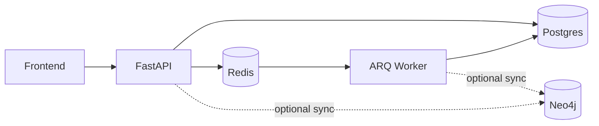

# Platform Overview — What We Built, How to Demo, How to Go Live

**Product:** Maharashtra Cyber / Mumbai Police Money-Trail Investigation Platform  
**Document date:** 2026-07-23  
**Audience:** Engineering + institutional stakeholders  
**Companions:** `mumbai-police-master-plan.md`, `mumbai-police-execution-checklist.md`, `phase11-to-phase20-audit-fixes.md`

---

## 1. What this system is (in one paragraph)

This is an **internal investigation cockpit** for cyber-fraud officers. It does **not** replace NCRP / CFCFRMS / 1930 as the national complaint channel. Its job starts **after** a complaint exists: register/triage the case inside the unit, ingest bank/mule hop data, draw the **multi-hop money trail**, score risk, link cross-case mules, generate **BNSS notices**, track **SLA**, and keep an **audit trail**.

```text
Citizen → (NCRP / 1930 / CFCFRMS — external) → Officer intake in THIS platform
        → Import statements / hops → Money-trail graph → Risk / watchlist / clusters
        → Legal notice PDF → Bank response (manual today) → Freeze / recovery tracking
```

---

## 2. What we have built (module map)

| Module | What it does today | Main UI / API |
|---|---|---|
| **Auth & RBAC** | Login with httpOnly JWT cookies, CSRF, roles Officer / Supervisor / Admin, user admin | `/login`, Admin Users |
| **Case intake** | Create case with complainant + Layer-1 suspect account; duplicate warnings; watchlist hit on create | Cases → New Complaint Intake |
| **Case lifecycle** | Validated status transitions, assignment (supervisor), closure reasons, recovery fields | Case detail header |
| **Search** | Search by case/FIR/NCRP/phone/account/UPI; **officer-scoped** | Navbar global search + case list |
| **Money trail** | Multi-hop BFS from Postgres (splits, cycles, dead-ends, pending); Cytoscape graph; JSON/CSV export | Case → **Trail** tab |
| **Bulk import** | CSV/Excel upload into a case; idempotent transactions; ImportJob status | Bulk Import + case import |
| **Evidence locker** | Upload with magic-byte validation, SHA-256 hash, audited download, soft-delete, optional notice/txn link | Case → **Evidence** |
| **Timeline** | Auto events (create, assign, status, import, notice, evidence) + manual notes; newest/chrono order | Case → **Timeline** |
| **Risk scoring** | Deterministic rules (velocity window, split-fund, repeat appearance, watchlist); account + case rollup | Case → **Risk** |
| **Watchlist** | Exact match on account+IFSC / UPI / phone; soft-deactivate; hits on intake/import | Watchlist & Rings |
| **Clusters / heat** | Soft (versioned) mule-ring recompute; linked case/account IDs; IFSC/PSP heat | Watchlist mule rings / network |
| **Legal notices** | BNSS-style Jinja → **real PDF**; status machine; sent PDF frozen; pack ZIP (CSV + trail annex) | Case → **Notices** |
| **SLA & notifications** | Configurable windows; overdue flags; in-app bell; **live SMTP email** when configured | Bell + Preferences |
| **Dashboards** | Officer prioritized queue; supervisor aggregates; honest external status labels | `/dashboard` |
| **Audit log** | Append-only application audits (login, case, import, notice, evidence, etc.) | Audit (supervisor+) |
| **Health** | `/health` probe + system health page | System Health |
| **Seed / CI** | Demo scenarios + Playwright E2E in CI | `scripts/seed.py`, GitHub Actions |
| **i18n** | English wired on main screens; Marathi stub deferred | Navbar language toggle |

### Tech stack

| Layer | Choice |
|---|---|
| Frontend | Vite + React + TypeScript + Tailwind |
| Backend | FastAPI (Python) |
| Primary DB | PostgreSQL (async SQLAlchemy + Alembic) |
| Graph | Neo4j (optional sync; **Postgres trail is authoritative**) |
| Queue / worker | Redis + **ARQ** background worker |
| Auth | bcrypt + JWT in httpOnly cookies + CSRF |

---

## 3. The background worker — what it is, what it does, is it needed?

### What it is

A separate process (Docker service `worker`) that runs:

```bash
arq app.workers.arq_worker.WorkerSettings
```

It listens on **Redis** and executes jobs that should not block the API request/response cycle.

**Code:** `backend/app/workers/arq_worker.py`  
**Compose:** `docker-compose.yml` → service `worker`

### Jobs it runs

| Job | Trigger | Purpose |
|---|---|---|
| `process_import_job` | Enqueued when a CSV/Excel is uploaded (if not using inline fallback) | Parses file, upserts accounts/transactions, updates ImportJob, syncs graph |
| `scan_overdue_slas` | **Cron — hourly** (and at worker startup) | Finds cases/notices past SLA; sets `sla_breached`; creates in-app notifications; sends email |
| `sample_background_task` | API startup ping (local only) | Health check that Redis + worker path works — **not business-critical** |

### Is it needed?

| Environment | Needed? | Why |
|---|---|---|
| **Local demo (quick)** | **Optional** | `INGESTION_INLINE_FALLBACK=True` processes imports **inside the API** if worker/Redis is down. SLA emails won’t fire on schedule without worker. |
| **Staging / production** | **Yes — required** | Inline fallback is **forced off** outside local. Large imports and hourly SLA scans must run in the worker. |

**Rule of thumb:**

- Want a **fast laptop demo of trail/notices** → API + Postgres (+ frontend) can be enough; imports still work inline.  
- Want **SLA alerts + production-like imports** → Redis **and** worker **must** be running.  
- Neo4j down does **not** stop trail (Postgres BFS); it only defers graph sync.



---

## 4. How data enters the system today

| Path | Who | What happens | Files land where |
|---|---|---|---|
| **Seed script** | Dev / CI | Creates 3 users + 3 demo fraud scenarios (shared mule) | DB rows only |
| **Case intake UI** | Officer | Manual complaint → case + Layer-1 account | Postgres |
| **CSV / Excel import** | Officer | Upload against a case → hops/transactions | `{UPLOAD_DIR}/{job_id}_{filename}` then DB |
| **Evidence upload** | Officer | Screenshots/PDFs on a case | `{UPLOAD_DIR}/evidence/...` + hash in DB |
| **Notice generate** | Officer | System builds PDF from template + case data | `storage/notices/*.pdf` |
| **CFCFRMS / bank API** | — | **Not built** | — |

Default upload dir: `backend/uploads/` (or Docker `/workspace/uploads/`).

---

## 5. Prototype vs final complete system

### 5.1 How we show the prototype **today** (honest demo script)

**Goal:** Prove the **investigation workflow**, not live bank/NCRP connectivity.

1. Login as seed officer → Dashboard (queue + **Bank Pilot = Not connected**, CFCFRMS = Simulated).  
2. Open seeded case **FIR-2026-001** (or create a new intake).  
3. **Trail** tab — multi-hop graph, filters, export.  
4. **Risk** tab — rules fired / scores.  
5. **Patterns / Watchlist** — related cases / mule rings.  
6. **Notices** — Generate Draft → PDF download → Pack ZIP.  
7. **Evidence** — upload a real PDF/PNG → hash shown.  
8. **Timeline** — auto + manual events.  
9. Supervisor: assign, SLA/breach strip, audit log.  
10. Say aloud: *“Bank replies and CFCFRMS feed are Phase 24; today officers upload structured files manually.”*

**Seed logins (local only):**

| Role | Email | Password |
|---|---|---|
| Officer | `officer.mumbai@maharashtracyber.gov.in` | `SecurePolice@2026` |
| Supervisor | `supervisor.mumbai@maharashtracyber.gov.in` | `SecurePolice@2026` |
| Admin | `admin.mumbai@maharashtracyber.gov.in` | `SecurePolice@2026` |

> Never use these passwords on a public staging URL. Provision real users first.

### 5.2 What “complete working” means (final operating model)

| Capability | Prototype today | Complete working |
|---|---|---|
| Users | Shared seed accounts | Real officers + strong passwords or **SSO** |
| Complaint source | Manual intake / seed | **CFCFRMS batch or API** + manual fallback |
| Bank hops | Seed CSV / officer Excel | Bank **structured replies** (file/API) + nodal directory |
| Notices | Engineering templates + “Local Legal Placeholder” | **Legal-signed BNSS** English (+ Marathi if required) |
| Email | **Live Gmail SMTP** (dev) | **Gov SMTP relay** + SPF/DKIM |
| Storage | Local disk | **Encrypted object storage** (S3/MinIO) + malware scan |
| Worker | Optional locally | Always-on ARQ + Redis |
| Neo4j | Optional | Provisioned if graph analytics required; else keep Postgres-authoritative honesty |
| Hosting | Localhost Docker | TLS staging/demo/prod, secrets manager, backups, monitoring |
| Security | Baseline + IDOR fixes | Phase 21 report + pen-test / CERT-In path (24.6) |
| Pilot data | Demo Bank A/B/C fiction | **Isolated staging** with **redacted real closed cases** |

---

## 6. How to test with **real** data **now** (without waiting for CFCFRMS/bank APIs)

You can validate the product with **real closed-case material** that officers already have (Excel trackers, bank PDFs/CSVs, screenshots). Keep it on an **isolated DB** and redact PII for any external demo.

### Step-by-step

1. **Environment**  
   - Prefer a separate Postgres DB (not the demo seed DB), or run `reset_demo_db` only if you accept wiping demos.  
   - Create **real named users** via Admin (do not rely on seed password).

2. **Create the case from paper/NCRP**  
   - Cases → **New Complaint Intake**.  
   - Enter FIR / NCRP ack / complainant / amount / Layer-1 account (from the real file).  
   - Acknowledge duplicates if the mule account already exists.

3. **Import hop data**  
   - Prepare CSV/Excel matching the downloadable **import template** (Bulk Import).  
   - Columns typically include source/dest accounts, amount, timestamp, UTR, bank, IFSC.  
   - Upload against that case → check ImportJob summary (new vs duplicate rows).

4. **Verify trail**  
   - Case → Trail: hops, amounts, dead-ends, pending.  
   - Export JSON/CSV annex for the brief.

5. **Evidence**  
   - Upload original bank PDF / SMS screenshots (allowed MIME types only).  
   - Confirm hash + audited download.

6. **Risk / watchlist**  
   - Add known mule UPI/account/phone to Watchlist → re-open case / re-import → hit banner.  
   - Risk tab → recompute → confirm rules.

7. **Notice**  
   - Generate draft → download PDF → download Pack.  
   - Mark status transitions; confirm **sent** PDF cannot be overwritten.  
   - *(Until legal signs templates, treat PDFs as engineering drafts.)*

8. **SLA / email**  
   - Ensure **worker** is running.  
   - Shorten SLA windows in `.env` for a test, or set a past `sla_due_at` on a test case.  
   - Confirm bell + SMTP inbox.

9. **Record outcomes** (for Phase 21/23 style report)  
   - Time to first usable trail.  
   - Hops recovered vs officer’s manual Excel.  
   - Misses / false links.  
   - Friction notes.

### What “real data” you need from the field (minimum pack)

| Item | Format | Why |
|---|---|---|
| 5–10 **closed** cyber-fraud cases | FIR/NCRP refs + narrative | End-to-end realism |
| Layer-1 + onward hop sheets | Excel/CSV | Import + trail |
| 1–2 bank reply samples | PDF/Excel | Future BankResponseAdapter design |
| Known mule identifiers | Account/IFSC/UPI/phone | Watchlist / related cases |
| Officer feedback | Notes | Phase 21 walkthrough |

---

## 7. Everything required for **complete** production working

### A. Must have (blocking for institutional pilot)

1. Hosted **staging** (TLS domain + locked CORS)  
2. Managed **Postgres + Redis** with strong secrets  
3. Unique **`SECRET_KEY`**, `DEBUG=false`, CSRF on  
4. **ARQ worker** always running  
5. **Gov SMTP** (or approved relay) replacing personal Gmail  
6. **Real user accounts** (or SSO) — no shared demo password  
7. **Encrypted object storage** for evidence + notice PDFs  
8. **Legal-signed BNSS templates** (name, designation, date, version)  
9. Written **PII retention / purge** rules  
10. Phase **21** reliability + security report signed off  

### B. Should have (full Band C operating model)

11. **CFCFRMS/NCRP batch import** (I4C access + sample exports)  
12. **Bank pilot** with 1–3 banks (nodal contacts + structured reply format)  
13. Malware scanning on uploads  
14. Sentry + uptime monitoring  
15. Pen-test / CERT-In / DPDP path  
16. Backup / DR / release process  

### C. Nice to have (later)

17. NPCI/UPI formal channel  
18. ML risk models (rules stay primary)  
19. Full Marathi legal UI strings  
20. Public citizen portal (only if HQ/I4C commissions it — see `implementation_plan_client_side`)

---

## 8. How to run the local prototype

```bash
# From repo root
docker-compose up --build -d

# Inside backend container or local venv
alembic upgrade head
python -m scripts.seed
```

| Service | URL / port |
|---|---|
| Frontend | http://localhost:5173 |
| API / Swagger | http://localhost:8000/docs |
| Health | http://localhost:8000/health |
| Postgres | localhost:5433 |
| Redis | localhost:6380 |
| Neo4j Browser | http://localhost:7474 |
| Worker | no port (background) |

SMTP for alerts is configured in **gitignored** `backend/.env` (`EMAIL_DELIVERY_MODE=smtp`).

---

## 9. Recommended path from here

| Order | Work | Outcome |
|---|---|---|
| **1** | Phase 21 — load, security, reliability, officer walkthrough | Proof the prototype is stable |
| **2** | Test with 5–10 **real closed cases** (manual intake + CSV) on isolated DB | Real-data confidence without waiting for APIs |
| **3** | Phase 24.1–24.2 — CFCFRMS batch + bank adapter using sample files | Complete operating model |
| **4** | Legal template sign-off + staging host + object storage | Institutional demo / pilot ask |

---

## 10. Short FAQ

**Q: Can we demo without the worker?**  
A: Yes for trail/notices/intake. No for scheduled SLA email scans and production-style async imports.

**Q: Is Neo4j required for the demo?**  
A: No. Trail runs on Postgres. Neo4j is sync/analytics.

**Q: Is email “real”?**  
A: Yes for configured SMTP (verified). Prefer gov SMTP before any leadership demo claiming institutional mail.

**Q: Are notice PDFs legally valid?**  
A: Not until domain legal replaces “Local Legal Placeholder” and certifies BNSS text.

**Q: Should we build the public complaint portal now?**  
A: No — not instead of Phase 21. That plan is a separate product decision (see `implementation_plan_client_side`).

---

## 11. Document control

| Version | Date | Notes |
|---|---|---|
| 1.0 | 2026-07-23 | Initial overview: built modules, worker, prototype vs complete, real-data testing |

**Bottom line:** You have a working **officer investigation prototype**. Test it now with **manual intake + real hop CSVs**. Keep the **worker** for SLA and production imports. Complete working requires **hosting, real users, legal templates, object storage, CFCFRMS/bank channels** — not more UI alone.
