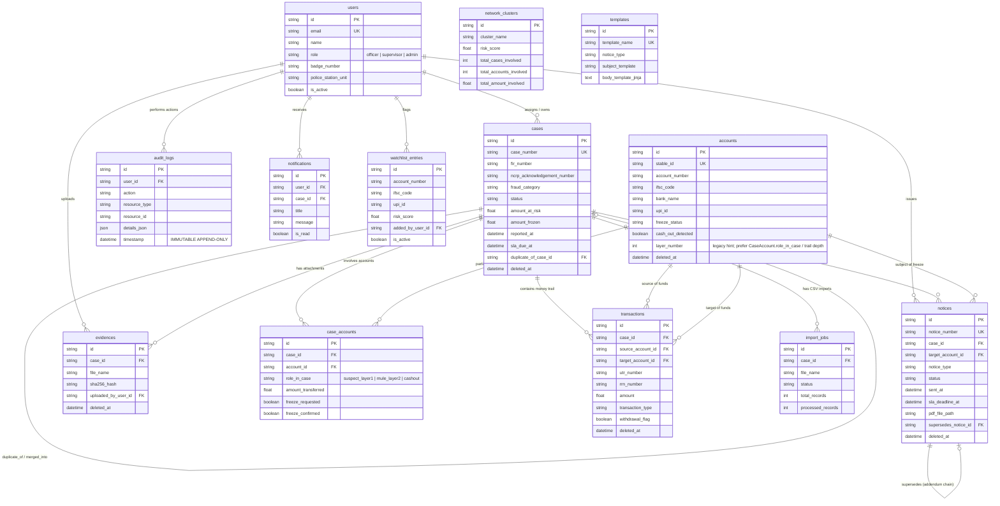
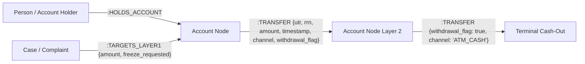

# Canonical Schema Entity-Relationship (ER) Diagram — Maharashtra Cyber Platform

This document defines the relational database architecture (`PostgreSQL 16`) and graph data structure (`Neo4j 5`) for the Mumbai Police Cyber Fraud Detection & Money-Trail Investigation Platform (`Phase 3`).

## 1. Relational ER Diagram (`PostgreSQL`)

---

## 2. Graph Schema (`Neo4j`)

### Neo4j Node Constraints & Indexes
- **Constraint:** `Account.stable_id` IS UNIQUE (`CREATE CONSTRAINT account_stable_id_unique`)
- **Constraint:** `Case.case_number` IS UNIQUE (`CREATE CONSTRAINT case_number_unique`)
- **Indexes:** `Account.account_number`, `Account.ifsc_code`, `Account.upi_id`, `Account.layer_number`, `Account.freeze_status`
