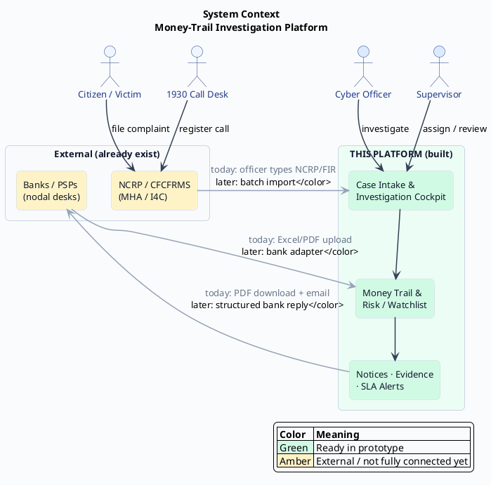
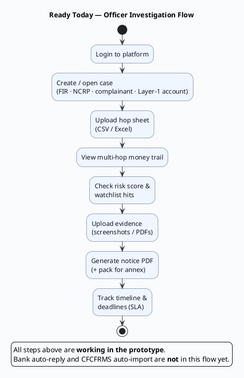
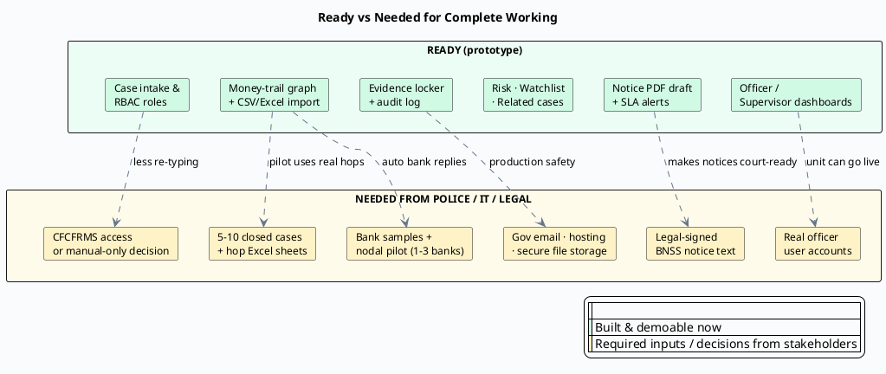
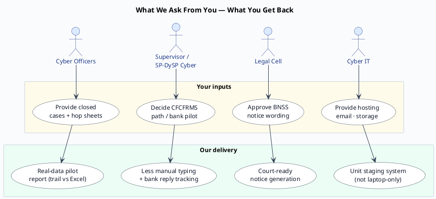

# Stakeholder Brief — Money-Trail Investigation Platform

**For:** Maharashtra Cyber / Mumbai Police leadership & team leads  
**Purpose:** Non-technical pitch — what is ready, what is missing, what we need from you  
**Date:** 2026-07-23  

> Use this 1–2 page brief in meetings. Generate the PlantUML diagrams below (copy each block into [PlantUML online](https://www.plantuml.com/plantuml) or VS Code PlantUML) and show the images on screen.

---

## 1. In one minute

We built an **internal investigation tool** for cyber-fraud officers.

It helps officers **follow the money** after a complaint is known — hop by hop — then prepare **legal notices**, track **deadlines**, and spot **reused mule accounts**.

It does **not** replace **1930 / NCRP / CFCFRMS**. Those remain the citizen complaint channels. This tool sits **after** that, inside the cyber cell.

| Status | Meaning |
|---|---|
| **Ready now** | Officers can demo and practice the full investigation workflow on a computer |
| **Needed next** | Real police access, real case files, legal approval, and (later) bank / NCRP connections |

---

## 2. What is READY today

You can already show:

1. **Login** with Officer / Supervisor / Admin roles  
2. **Register a case** (complainant + first suspect account)  
3. **Upload bank / hop Excel or CSV** and see the **money trail graph**  
4. **Risk score** with simple rules (fast movement, split funds, known bad accounts)  
5. **Watchlist** of mule accounts / UPI / phone  
6. **Related cases** when the same mule appears again  
7. **Evidence locker** (upload + secure hash)  
8. **Legal notice draft PDF** (BNSS-style) + download pack  
9. **Deadlines (SLA)** with alerts (email can go to inbox when SMTP is set)  
10. **Audit trail** of who did what  

**Honest labels already on screen:** Bank pilot = *Not connected* · CFCFRMS = *Simulated* (manual entry today).

---

## 3. What is NOT complete yet (required for full live working)

| Missing piece | Why it matters | Who unlocks it |
|---|---|---|
| **Real officer accounts** (not demo passwords) | Safe use by the unit | Cyber Cell + IT Admin |
| **Legal-approved notice wording** | Notices must be court-ready | Legal cell / designated signer |
| **5–10 closed real cases** (redacted) for pilot | Prove it works on real patterns | Investigating officers |
| **Sample bank reply files** (Excel/PDF) | Design bank intake | Bank nodal / Cyber HQ letter |
| **NCRP / CFCFRMS export access** (or written “manual only”) | Less re-typing of complaints | SP/DySP Cyber → I4C |
| **Official email / hosting / secure file storage** | Run as unit system, not laptop demo | Maharashtra Cyber IT |
| **Bank pilot agreement** (1–3 banks) | Structured replies, not only manual upload | Cyber HQ + banks |

Until those arrive, the system is a **working prototype** — excellent for training and walkthrough — not a full statewide live service.

---

## 4. What we need FROM police / officers (ask list)

Bring these to the next meeting if possible:

### A. For a real-data pilot (next 2–4 weeks)
- [ ] **5–10 closed cyber-fraud cases** (FIR / NCRP number + short story)  
- [ ] **Excel/CSV of money hops** for those cases (accounts, amounts, dates, UTR if any)  
- [ ] **1–2 sample bank replies** (whatever format banks actually send)  
- [ ] **2–3 known mule** account / UPI / phone numbers for watchlist testing  
- [ ] **1 champion officer + 1 supervisor** to walk through the screens and give feedback  

### B. For institutional go-live (parallel track)
- [ ] **Named legal officer** to approve BNSS notice text (name, designation, date)  
- [ ] **Official SMTP / email** for SLA alerts (gov mail preferred)  
- [ ] **Decision on CFCFRMS:** batch file access **or** “manual NCRP entry for Phase 1”  
- [ ] **Letter intent** for 1–3 bank nodal pilots  
- [ ] **IT:** staging URL, secure storage for evidence/PDFs, real user IDs  

### C. What officers get back when they provide the above
| If you provide… | We deliver… |
|---|---|
| Closed cases + hop sheets | Trail graph + time-saved comparison vs Excel |
| Bank reply samples | Automatic import design for that bank format |
| Legal sign-off | Notices without “draft / placeholder” status |
| CFCFRMS samples | Daily complaint import (less re-typing) |
| Bank nodal pilot | “Awaiting bank” tracking with real reply flow |

---

## 5. How we recommend pitching (3 slides worth of talk)

1. **Problem:** After Layer-1 freeze, officers lose time in Excel chasing hops and drafting notices.  
2. **Solution (ready):** One cockpit — trail, risk, watchlist, evidence, notice PDF, deadlines.  
3. **Ask:** Closed cases + legal text + (later) bank/NCRP access → move from prototype to unit pilot.

---

## 6. PlantUML diagrams — generate these as images

Copy each `plantuml` block into a PlantUML renderer.  
Theme: **light professional** (navy + slate, white background).

---

### Diagram 1 — Where this tool sits (Context)

**File suggestion:** `diagram-01-system-context.puml`  
**Show this first:** “We don’t replace 1930 — we help after the complaint exists.”

---

### Diagram 2 — Officer journey that is READY (Activity)

**File suggestion:** `diagram-02-officer-ready-flow.puml`  
**Show this second:** “This is what we can demo on a laptop today.”

---

### Diagram 3 — Ready vs Missing (Gap / Deployment view)

**File suggestion:** `diagram-03-ready-vs-needed.puml`  
**Show this third:** “Green = we have it. Amber = we need your help.”

---

### Diagram 4 — If you provide X → we deliver Y (Use-case style)

**File suggestion:** `diagram-04-ask-and-outcomes.puml`  
**Show this last:** “Clear ask — clear return.”

---

## 7. How to generate the images quickly

1. Open https://www.plantuml.com/plantuml/uml  
2. Paste one diagram block (from `@startuml` to `@enduml`)  
3. Export **PNG** or **SVG**  
4. Name files:
   - `01-system-context.png`
   - `02-officer-ready-flow.png`
   - `03-ready-vs-needed.png`
   - `04-ask-and-outcomes.png`  
5. Put them in a folder `docs/stakeholder-diagrams/` for the pitch deck

---

## 8. Closing line for the room

> “The investigation cockpit is ready to walk through today.  
> To make it a complete unit system, we need your closed cases, legal notice approval, and decisions on NCRP/bank connections — then we connect those channels and move to a controlled pilot.”

---

**Document control:** v1.0 — 2026-07-23 — Stakeholder non-technical brief + PlantUML sources  
**Detail reference (technical):** `docs/platform-overview-prototype-vs-complete.md`
